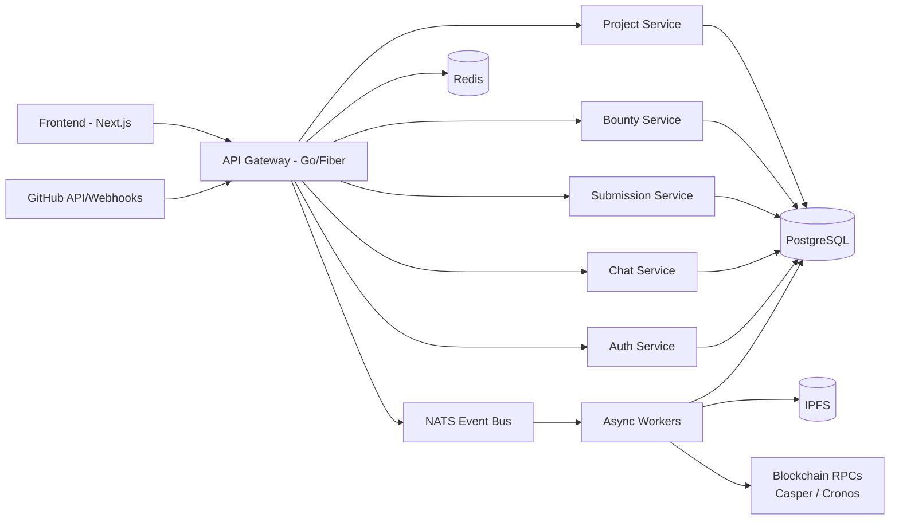
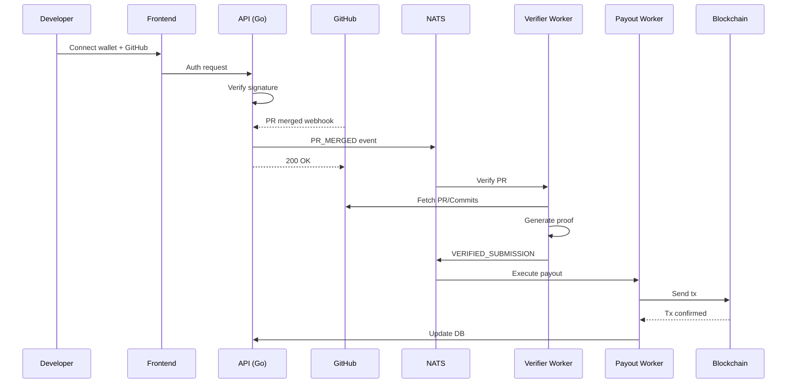
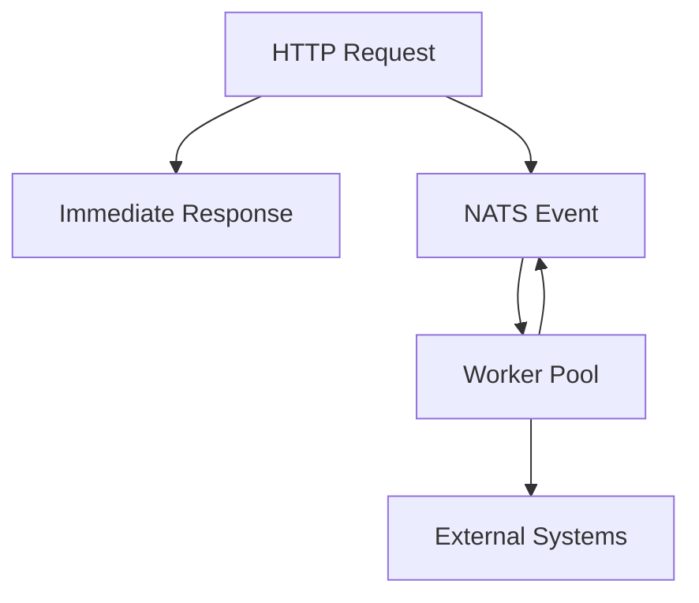
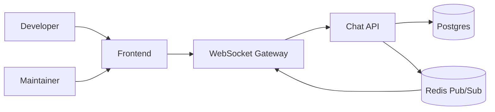
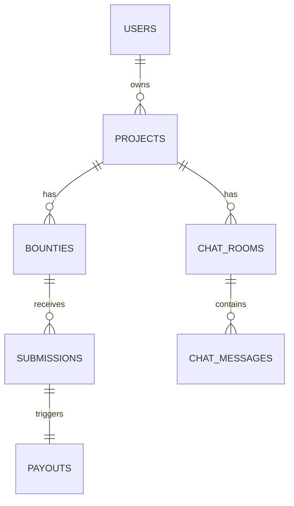

# 📘 Patchwork – Backend Architecture & System Flow

Patchwork is an infrastructure-grade platform that connects open-source developers with open-source projects through verifiable contributions, automated rewards, and reputation — across multiple blockchain ecosystems.

## 1. High-Level System Architecture

## 2. Core Backend Tech Stack

### Language & Runtime

Go 1.22+

### HTTP Layer

Fiber (fasthttp based)

### Database

PostgreSQL

Driver: pgx (no ORM)

### Cache & Rate Control

Redis

### Eventing / Async

NATS

### Blockchain

Casper RPC

Cronos RPC + x402 facilitator

### Storage

IPFS (verification proofs, metadata)

### Auth

Wallet signature auth

GitHub OAuth

JWT (short-lived)

## 3. Core Features (Backend-Owned)

### 🔐 Authentication

Wallet login (EVM / Casper)

GitHub OAuth linking

Role-based access (maintainer / contributor / admin)

### 📦 Project Registration

Register OSS project

Verify GitHub repo ownership

Enable GitHub webhooks

Chain-agnostic project identity

### 🧵 Issue & PR Sync

Auto-sync GitHub issues

Track PR lifecycle

Deduplicate webhook events

Rate-limit safe GitHub fetchers

### 💰 Bounties & Grants

Create bounties on issues

Lock funds in on-chain escrow

Multi-chain rewards

Deadlines & milestones

### 🔀 Submissions & Verification

Auto PR submission tracking

Merge verification

Issue ↔ PR ↔ bounty matching

Proof generation (JSON → IPFS)

### 💸 Automated Payouts

Async payout execution

Retry-safe chain transactions

x402 conditional payments (Cronos)

Escrow release (Casper)

### 🧠 Reputation System

Contribution scoring

On-chain / off-chain hybrid

Leaderboards

PatchQuest snapshots

### 🏆 PatchQuest (Monthly Hackathon)

Time-boxed contribution cycles

Ranking by verified impact

Reward pools

Community visibility

## 4. End-to-End Contribution Flow

## 5. Async Processing Model (Critical)

### Rule

❌ No GitHub / RPC / heavy logic in HTTP path

✅ Everything slow is async

## 6. Chat System (Dev ↔ Maintainer)

### Purpose

Allow contributors to talk directly with maintainers

Scoped to project or bounty

Auditable & moderation-friendly

### Chat Architecture

### Chat Features (Backend)

Project-scoped rooms

Bounty-specific threads

Wallet-verified identity

Read receipts

Rate limiting

Moderation flags

Optional message hashing (future on-chain anchoring)

### Chat Data Model

chat_rooms

- id

- project_id

- bounty_id (nullable)

chat_messages

- id

- room_id

- sender_wallet

- content

- created_at

## 7. Database Schema (Core Tables)

## 8. Security & Trust Guarantees

Webhook signature verification

Idempotent event processing

Replay protection

Chain tx confirmation checks

Audit logs

KYC/AML hooks (admin only)

## 9. Why This Backend Is Correct

Low latency (1–5ms API)

High concurrency (goroutines)

Fault-tolerant

Chain-agnostic

Infra-grade

Foundation-friendly

This backend can support:

Casper Hackathon

Cronos x402

Long-term grants

Millions of PR events

## 10. Next Extensions (Planned)

AI PR reviewer

AI contributor matching

Milestone-based grants

DAO voting integration

Cross-chain identity

zk-proof-based verification

